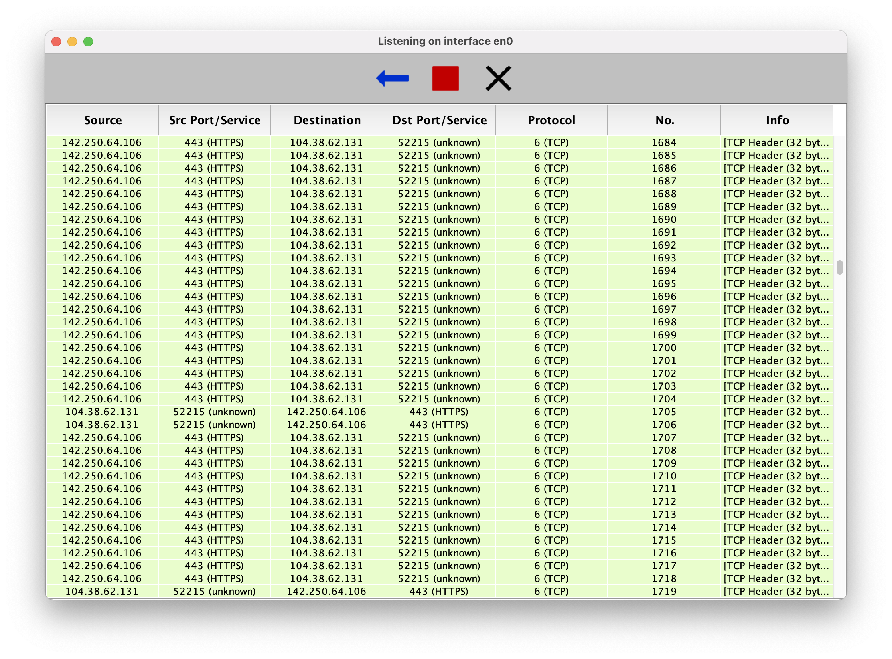

# Packet Sniffer
Created by [Justin Tovar](https://github.com/jtovar43)

_**NOTE: This project is under active development as a personal project and not intended for production**_

This is a simple packet sniffer written in Java that utilizes the [pcap4j](https://github.com/kaitoy/pcap4j) library.

See screenshots of the project are below:

